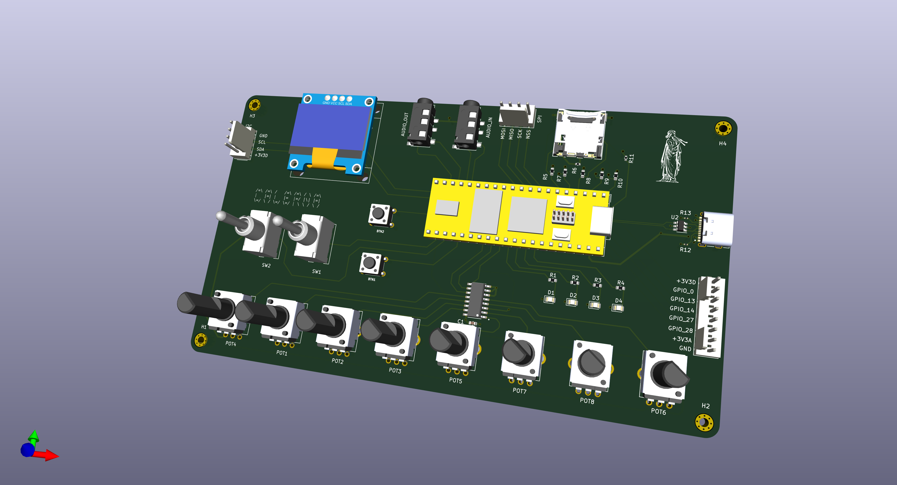

# galernaDaisy :ocean::ocean:

**_Galerna_** is an auxiliary board for [Electrosmith Daisy Seed](https://www.electro-smith.com/daisy/daisy). 

The board contains:

- 8 pots 
- 2 mechanical switches
- 2 buttons
- 4 LEDs
- Audio in & Audio out
- OLED Screen
- SPI connector
- I2C connector
- SD card
- GPIO connector: 6 pins 

I designed the board to test different audio projects with daisy.

This repo contains the infrastructure code to control _Galerna_, and some Apps that I wrote just for fun.   

The project depends on the following _Electrosmith_ libraries:

- [libDaisy](https://github.com/electro-smith/libDaisy)
- [DaisySP](https://github.com/electro-smith/DaisySP)
